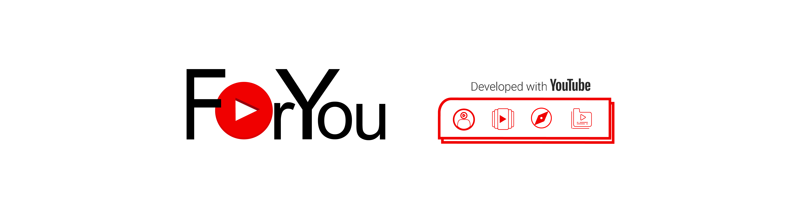
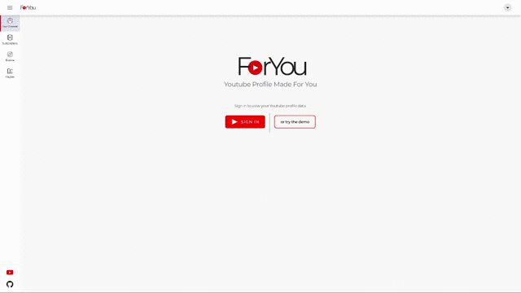

# [ForYou](https://foryoutube.herokuapp.com/)

> A concept that visualizes personal youtube profile data using React and Node.js built around googleapis; OAuth2 and youtube data api v3.




## Table of Contents

- [ForYou](#foryou)
  - [Table of contents](#table-of-contents)
  - [Overview](#overview)
  - [Features](#features)
  - [Demo](#demo)
  - [Screenshots](#screenshots)
  - [Tech Stack](#tech-stack)
    - [Built with](#built-with)
  - [Environment Variables](#environment-variables)
  - [Run Locally and Setup](#run-locally-and-setup)
  - [Roadmap](#roadmap)
  - [Author](#author)
  - [Acknowledgments](#acknowledgments)
    - [Useful resources](#useful-resources)
  - [License](#license)
## Overview

Greetings Everyone! This project is made for the purpose of using the current Youtube data API and extending its powerful functionalities.
## Features

- Youtube Profile Data
- Youtube feed video suggestions using puppeteer
- Light/dark mode toggle
- Device Responsiveness


## Demo

Desktop:  


Mobile:  


## Screenshots

See [screens section](./screens/README.md).

## Tech Stack

**Client:** React, Redux

**Server:** Node, Express

### Built With

- Youtube Data API V3, Google APIs OAuth2
- Typescript
- React, Redux, React Router V6, SCSS Modules
- Node.js, Express
- Puppeteer
- Webpack

## Environment Variables

To run this project, you will need to add the following environment variables to your .env file
Get client credentials from [project API credentials](https://console.cloud.google.com/apis/credentials).

`NODE_ENV` = production

`CLIENT_ID` = XXXXX

`CLIENT_SECRET` = XXXXX

`REDIRECT_URI` = `host-server`:5000/auth/callback


## Run Locally and Setup

1. Clone the project

```bash
  git clone git@github.com:almoratalla/foryou.git
```

2. Go to the project directory

```bash
  cd foryou
```

3. Install dependencies

```bash
  npm install
```

4. Register a project in google cloud console and [enable the Youtube Data API](https://developers.google.com/youtube/v3/guides/auth/server-side-web-apps#enable-apis). Proceed in [creating authorization credentials](https://developers.google.com/youtube/v3/guides/auth/server-side-web-apps#creatingcred). See [Youtube Data API Authentication guide](https://developers.google.com/youtube/v3/guides/authentication)

5. Create an `.env` file in the root of the project using the format from `.env.sample`. [Set up environment variables](#environment-variables).

6. Start the server without build files (initial setup)

```bash
  npm run stage
```

or start the server with build files

```bash
  npm run start
```

## Roadmap

- Add more features for videos, playlists and explore


## Author

- [Alain Moratalla](https://www.github.com/almoratalla)

## Acknowledgements

This project is heavily inspired by the project [Spotify Profile](https://spotify-profile.herokuapp.com/) by [Britanny Chiang](https://brittanychiang.com/) and the code structure of the app [TakeNote](https://takenote.dev/). I would like to give huge appreciation to the aforementioned projects. This project also received major help from one of my colleagues, [Larz Pal-ing](https://github.com/larzthimotypal-ing), who consulted on styling and responsiveness. Also, ForYou is a project dependent and integrates with the Youtube data API V3. This app would no longer be useful if not for the availability of the Youtube data API that allows developers to incorporate Youtube functionalities to their app. Lastly, all these would not be made if not for the following resources:

### Useful Resources

 - [Spotify Profile](https://github.com/bchiang7/spotify-profile) by [Britanny Chiang](https://brittanychiang.com/) - This is the major inspiration for this project. I tried a version of the app using YouTube functionalities instead.

 - [TakeNote](https://github.com/taniarascia/takenote) - I searched for samples of apps that run on a MERN stack and found their structures to be suitable for this project. I loved it and made it the guide for the structure of this project.

 - [React Course by Academind](https://www.udemy.com/course/react-the-complete-guide-incl-redux/) - My fundamentals in React came from this course.

 - [Youtube Data API Reference](https://developers.google.com/youtube/v3/docs) - All samples and references in using the functionalities from Youtube data API came from this site.

 - [Demo Starter Template With SASS by Kevin Powell](https://github.com/kevin-powell/demo-starter-template-with-sass) - Template guide for the styles of the app.
## License

ForYou is [MIT licensed](./LICENSE)
